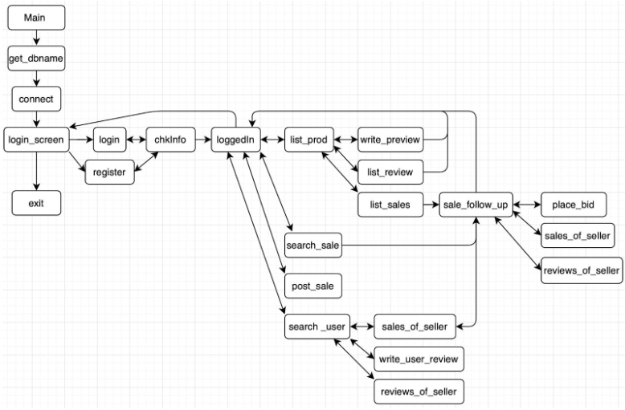

# Auction House

A command line based app that allows users to login/register, then follow instructions to:
- view items for auction
- bid on items
- list items for sale
- give product reviews
- give user reviews
- view user details

## Design

### Functions:
main - main loop of program, setup database and go to login screen

get_dbname - db name should be provided as command line arg, if not provided, prompt to
enter it

connect - connect to the specified database

login_screen - main menu: allow users to sign in, register or exit

login - allow user to login with echo free password input

register - add new user to database based on entered info then automatically log user in

chkInfo - if logging in, check if login is valid while protecting against injection. If registering
username must not already exist in the database.

loggedIn - display options available for logged in user

list_prod - list products with active sales and provide options for these products

write_preview - submit a product review for specified pid

list_review - list all ratings+reviews for specified pid

list_sales - find all active sales associated to specified pid and call follow up options for
displayed sales

sale_follow_up - additional options to perform on a selected sale

place_bid - post a bid on a selected sale

search_sale - search for sale listings with keywords and provide follow up options for matches

post_sale - create a sale to place into auction. Provides an option to associate a product to the
sale, if the product does not exist in the database - add it.

search_user - search for keywords in user email or name and provide follow up options to
perform with matches

sales_of_seller - get additional info for all sales from a specified user and provide options for
the sales

write_user_reviews - enter a review on a specified user

reviews_of_seller - show all reviews written about the seller

